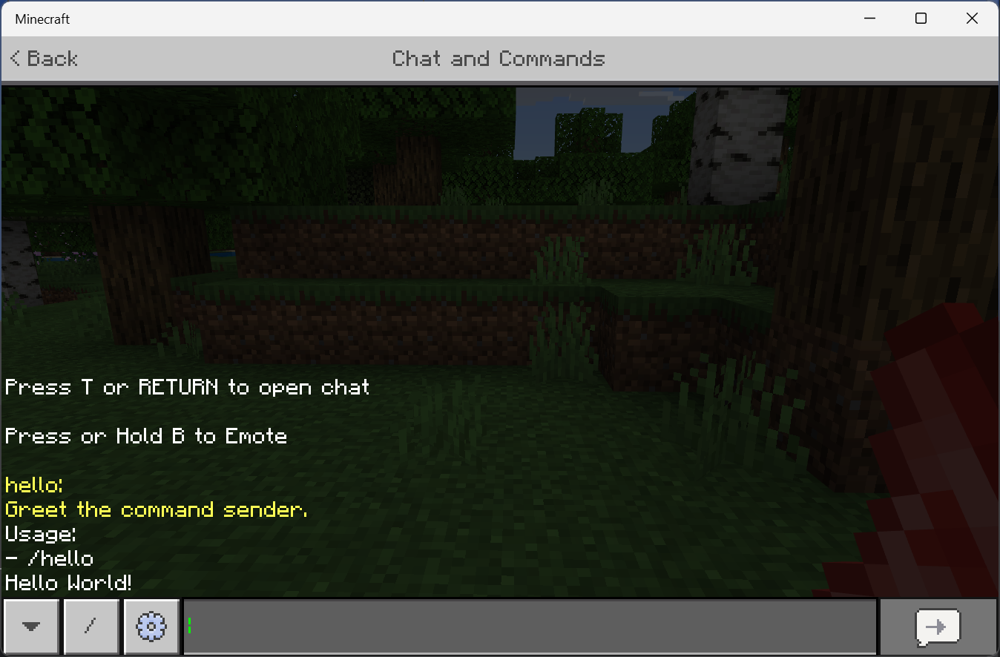

# Register commands

In this section, we'll walk you through creating a simple command using Python. By the end of this section, you'll have
a basic understanding of how to define and register commands with Endstone.

## Create a simple command

Let's start with a simple command `/hello` that greets the command sender.

=== ":fontawesome-brands-python: Python"

    ``` python title="src/endstone_my_plugin/my_plugin.py" linenums="1" hl_lines="9-14"
    from endstone.plugin import Plugin

    class MyPlugin(Plugin):
        name = "MyPlugin"
        version = "0.1.0"
        api_version = "0.4"
        description = "My first Python plugin for Endstone servers!"

        commands = {
            "hello": {
                "description": "Greet the command sender.",
                "usages": ["/hello"],
            }
        }

        # ...
    ```

=== ":simple-cplusplus: C++"

    ``` c++ title="src/my_plugin.cpp" linenums="1" hl_lines="7-9"
    #include "my_plugin.h"

    ENDSTONE_PLUGIN(/*(1)!*/"MyPlugin", /*(2)!*/"0.1.0", /*(3)!*/MyPlugin)
    {
        description = "My first C++ plugin for Endstone servers";

        command("hello")
            .description("Greet the command sender.")
            .usages("/hello");
    }
    ```

And it's just as simple as that! We created a new command with description and usages.

## Handle the commands

Now, the next step is to handle the commands we just created. Let's say we want to send a "Hello, World!" greeting
message to whoever execute this command.

=== ":fontawesome-brands-python: Python"

    ``` python title="src/endstone_my_plugin/my_plugin.py" linenums="1" hl_lines="1 17-21"
    from endstone.command import Command, CommandSender
    from endstone.plugin import Plugin

    class MyPlugin(Plugin):
        name = "MyPlugin"
        version = "0.1.0"
        api_version = "0.4"
        description = "My first Python plugin for Endstone servers!"

        commands = {
            "hello": {
                "description": "Greet the command sender.",
                "usages": ["/hello"],
            }
        }

        def on_command(self, sender: CommandSender, command: Command, args: list[str]) -> bool:
            if command.name == "hello":
                sender.send_message("Hello World!")

            return True

        # ...
    ```

=== ":simple-cplusplus: C++"

    ``` c++ title="include/my_plugin.h" linenums="1" hl_lines="5-12"
    #include "endstone/plugin/plugin.h"

    class MyPlugin : public endstone::Plugin {
    public:
        bool onCommand(endstone::CommandSender &sender, const endstone::Command &command, const std::vector<std::string> &args) override
        {
            if (command.getName() == "hello") 
            {
                sender.sendMessage("Hello World!");
            }
            return true;
        }

        // ...
    };
    ```

Now, [install] your plugin and restart your server. Join the game and type `/help hello`. You should see the usage information, which indicates that our command has been successfully added to the game!

Now, type `/hello`, and you should receive the message "Hello World!".



[install]: install-your-plugin.md

## Add parameters to commands

## Add permissions

## Add aliases